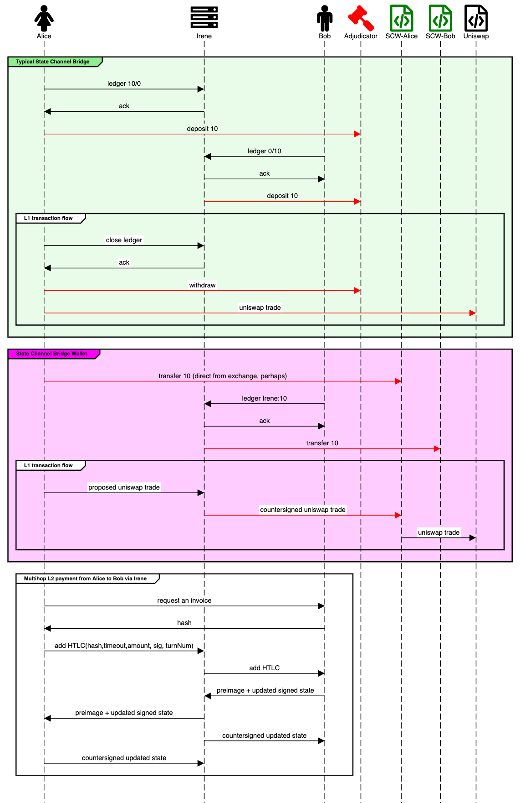

<h1 align="center">

 
SCBridge-Wallet
</h1>
<h3 align="center">
An L2 state channel bridge contract which is also an L1 smart contract wallet.
</h3>

### Ingredients

This repo contains Solidity source code for a novel type of state channel bridge smart contract. It offers the unique feature that deposited funds can not only be used to send offchain payments to other channel network participants with zero fees and instant finality, but also to send arbitrary transactions on the underlying L1 blockchain without having to withdraw them first in a separate transaction.

This functionality is achieved by inviting a channel network peer to be a co-signatory "guest" on your smart contract wallet. L1 transactions are first send to that "guest", who countersigns them and submits them to the mempool. The guest therefore plays a role similar to an EIP 4337 "bundler" (only simpler, and with a peer-to-peer private "mempool"). Although the "guest" can be ejected at any time (and then either replaced with another guest, or not), they have the right to veto any L1 transaction. This allows them to ensure they retain any off chain payments promised to them by the wallet owner. If they are ejected, they get to take that money with them.

By having that guest perform the same role in several users' smart contract wallets, the off chain payments can be routed over arbitrary hops through a payment network (a la Bitcoin Lightning).

This repo also contains Typescript source code for off-chain clients that can be run by a user and by a guest, to enable to orchestrate the functionality described above.

### Method

#### User

#### Guest

### Sequence Diagram

Alice wants to a) pay Bob offchain and b) execute a trade on uniswap. In a typical state channel bridge architecture (green) she must deposit funds into the ID of a "ledger channel" in a Singleton adjudicator contract. Her counterparty in that ledger channel (Irene) must have deposited into another ledger channel with Bob.

Executing a mulithop payment from Alice to Bob (white) is then as easy as executing the well known HTLC (Hash Timelocked Contract) protocol.

If Alice wants to execute her uniswap trade with those deposited funds, she needs to wrap up the ledger channel, withdraw the funds (in one L1 tx), and submit the trade (in another L1 tx).

With the State Channel Bridge Wallet (SCBridge-Wallet) Architecture, she can instead propose the uniswap trade to Irene, who checks that it doesn not compromise any HTLC payments made so fat, and then countersigns it and submits it to Alice's SCBridge-Wallet. The SCBridger-Wallet validates the countersigned transaction and calls into uniswap to execute the trade.

<!-- diagram source, edit at sequencediagram.org
fontawesome f182 Alice
fontawesome f233 Irene
fontawesome f183 Bob

fontawesome f0e3 Adjudicator #red
fontawesome f1c9 SCW-Alice #green
fontawesome f1c9 SCW-Bob #green
fontawesome f1c9 Uniswap

group #lightgreen Typical State Channel Bridge

Alice->Irene: ledger 10/0
Alice<-Irene: ack
Alice-#red>Adjudicator: deposit 10
Bob->Irene: ledger 0/10
Bob<-Irene: ack
Irene-#red>Adjudicator: deposit 10
group L1 transaction flow
Alice->Irene: close ledger
Alice<-Irene: ack
Alice-#red>Adjudicator: withdraw
Alice-#red>Uniswap: uniswap trade
end
end

group #ff00ff State Channel Bridge Wallet
Alice-#red>SCW-Alice: transfer 10 (direct from exchange, perhaps)
Bob->Irene: ledger Irene:10
Bob<-Irene: ack
Irene-#red>SCW-Bob: transfer 10
group L1 transaction flow
Alice->Irene: proposed uniswap trade
Irene-#red>SCW-Alice: countersigned uniswap trade

SCW-Alice->Uniswap: uniswap trade
end

end

group Multihop L2 payment from Alice to Bob via Irene
Alice->Bob: request an invoice
Bob->Alice: hash
Alice->Irene: add HTLC(hash,timeout,amount, sig, turnNum)
Irene->Bob: add HTLC
Bob->Irene:  preimage + updated signed state
Irene->Alice: preimage + updated signed state
Irene->Bob: countersigned updated state
Alice->Irene: countersigned updated state
end
-->
